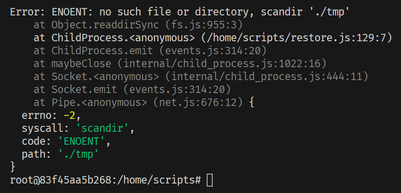

# Froyo Notes

## Before Starting

Make sure you have Node version `v14.17.0` and NPM version `6.14.13`.

## Setting up Froyo

In this section you can find the step by step guide in order to set up Froyo in your system.

First you have to clone the repository in your local, wherever you keep your desired repositories stored on your system:
```bash
git clone https://github.com/BetssonGroup/cbt-froyo.git
cd cbt-froyo
```
Once you have froyo in your local, within the froyo directory, build and run the Docker container:

```bash
docker-compose build
docker-compose up -d
```

Afterwords, you can go to [localhost:8080](http://localhost:8080/), where you will have to go through the installation wizard of wordpress. In this wizard you just select your preferred language and enter the site title, username and password (all of your choice).

Use `docker ps` to find out the short container ID of the froyo wordpress container, and put that ID in the bottom line below. 

```bash
docker exec -it {{docker_id}} bash
```
In the default directory given, enter these two commands:

```bash
chown www-data:www-data -R *
chmod -R 777 wp-content/
```
## Restoring Database

Once you have Froyo wordpress running on your local, you need to restore a database and the files of an already existing production environment to your local one. This can be done in the following steps:

1. If you haven't yet, ask for someone who can give you an invitation to the pagely account with regards to Froyo, and set up your password (from the link in the email invitation)
2. After signing in, go to https://atomic-beta.pagely.com/
3. Browse through the __Apps__ tab and select a brand (does not matter which)
4. Go the the __Backups__ tab of that site and press `Request Download` on the latest version.
5. Go to the terminal of the __cbt-froyo-worpress__ container and `cd` to `/home/scripts`
6. Run `npm install` and then `node restore`
7. Press enter on the __all__ option given
8. Paste the __SQL link__ from pagely when prompted the database (Copy link address on button)
9. Paste the __Files link__ from pagely when prompted the files

To realise whether it finished or not, checkout the root's `bin` folder to see whether __tmp__ has a lot of files in it. When __tmp__ is empty, the process is finished.

It might take a while to restore the database, but when it is finally ready, you have to redirect to the `plugins` directory and then in the `themes` directory and run the following in each of these direcotries:

```bash
npm install
npm run build
```

Once all of that is ready, you have to change the domain and login on PHPMyAdmin:

1. Go to [localhost:8181](http://localhost:8181/)
2. Log in (credentials below, if not changed)
    - Username: root
    - Password: ChangeMeIfYouWant
3. Go to __wp_options__ (display all rows to make it easier)
4. change _siteurl_ to http://localhost:8080/
5. change _home_ to http://localhost:8080/
6. Go to __wp_users__ and either edit a user with admin rights and change the password (ex. 1234), make sure the user_pass is of type MD5. You can change other credentials if you want.


To see whether it worked or not, go to [WP Admin](http://localhost:8080/wp-admin), where you should have Plugins, Froyo Options etc... on the side menu. Then when you go to the top left and hover over the site title, the menu opens a `Visit Site` button. It should redirect you to [localhost:8080](http://localhost:8080/) 

## Troubleshooting

### Tmp File
Whenever this error comes after restoring the database and files links
<p align="center">
  
</p>

Go to the froyo directory, and undet the `bin` folder, add another empty folder named __tmp__.

### Polylang Problem
Whenever this error comes up:
<p align="center">
  
</p>

Go to plugins/dist and remove the __polylang-pro__ folder and rebuild the plugins directory.

After that, ask for someone to give you the polylang-pro.zip file, then go to _Plugins_. Then click on __Add New__ and __Upload Plugin__, where you will choose the given zip file. Try using this polylang zip file below:
[Polylang Pro Zip](polylang-pro.zip)