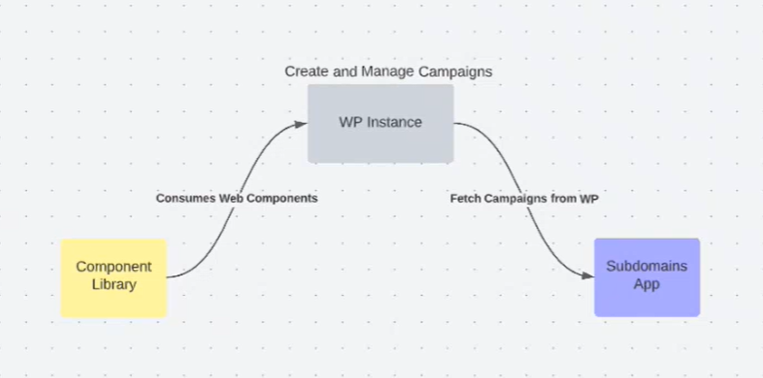

# Gecko Notes

## Overview
The __Gecko__ Project consists of __3__ main repositories:
- [Component Library](https://github.com/BetssonGroup/cbt-gecko-component-library) - Used to create Web Components, by using __StencilJS__.
- [WordPress(WP) Instance](https://github.com/BetssonGroup/cbt-gecko-wordpress) - Consumes Web Components created from the Component Library. This repository is used to __create__ and __manage__ campaings for landing pages.
- [Subdomains App](https://github.com/BetssonGroup/cbt-gecko-frontend) - This repository is the frontend application for the Gecko project, which fetches the Campaigns from the WP Instance repo.

  

## Component Library Repository
The main purpose of this repository is to create a library of Web Components, created manually by using the StencilJS tool, which will eventually be used by the Wordpress Plugin Repository to create a somewhat "drag and drop" style application which will add and customise the Web Components retrieved from this repository.

These Web Components will be exported and then imported to the WP plugins as __blocks__.

It is important to note that these Web Components need to be developped in a way to be customisable since there are multiple different brands which will be used within this company.

### Shadow DOM
The Shadow DOM is a separate tree structure (DOM) which can be attachted to a Component. Therefore when creating a custom component, it will have its own (shadow) DOM. This becomes very helpful when importing the custom component to other projects and frameworks where this component may be useful. This is because when importing this component, any styling set in the outer project will not affect the the styling of the custom component. This is because the shadow DOM prevents any styling of the outer project to be implemented within the shadow DOM itself. Therefore Web Components created with Stencil would be completely compatible with outer projects using any type of style (pure HTML), framework (React, Angular, Vue), OS(Windows, Mac), browser(Chrome, Firefox), etc...

### StencilJS
Stencil is the main application used in this repository. It is a "Web Components Compiler", and it is __not__ a framework. It is practically used to generate custom Web Components. Gives you an extra layer of security in the long run. It uses Typescript, JSX and CSS.

## WordPress Instance (Multiple Plugin) Repository
