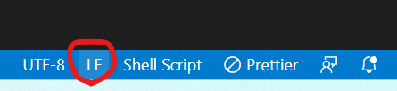

# Overview
The __Gecko__ Project consists of __3__ main repositories:
- [Component Library](https://github.com/BetssonGroup/cbt-gecko-component-library) - Used to create Web Components, by using __StencilJS__.
- [WordPress(WP) Instance](https://github.com/BetssonGroup/cbt-gecko-wordpress) - Consumes Web Components created from the Component Library. This repository is used to __create__ and __manage__ campaings for landing pages.
- [Subdomains App](https://github.com/BetssonGroup/cbt-gecko-frontend) - This repository is the frontend application for the Gecko project, which fetches the Campaigns from the WP Instance repo.

<p align="center">
  
</p>

# Component Library Repository
The main purpose of this repository is to create a library of Web Components, created manually by using the StencilJS tool, which will eventually be used by the Wordpress Plugin Repository to create a somewhat "drag and drop" style application which will add and customise the Web Components retrieved from this repository.

These Web Components will be exported and then imported to the WP plugins as __blocks__.

It is important to note that these Web Components need to be developped in a way to be customisable since there are multiple different brands which will be used within this company.

## Shadow DOM
The Shadow DOM is a separate tree structure (DOM) which can be attachted to a Component. Therefore when creating a custom component, it will have its own (shadow) DOM. This becomes very helpful when importing the custom component to other projects and frameworks where this component may be useful. This is because when importing this component, any styling set in the outer project will not affect the the styling of the custom component. This is because the shadow DOM prevents any styling of the outer project to be implemented within the shadow DOM itself. Therefore Web Components created with Stencil would be completely compatible with outer projects using any type of style (pure HTML), framework (React, Angular, Vue), OS(Windows, Mac), browser(Chrome, Firefox), etc...

## StencilJS
Stencil is the main compiler used in this repository. It is a "Web Components Compiler", and it is __not__ a framework. It is practically used to generate custom Web Components. Gives you an extra layer of security in the long run. It uses Typescript, JSX and CSS.

## Node Version

It is important to note that Gecko works with __Node Version__ ``v14.17.0``, and __NPM Version__ ``v6.14.13``. NVM can be used to fix this.

If you don't have the version run:
```bash
nvm install 14.17.0
```

To switch to that specific node version:
```bash
nvm use 14.17.0
```

## Cloning and Installing the Repository
```bash
git clone git@github.com:BetssonGroup/cbt-gecko-component-library.git
cd cbt-gecko-component-library
git checkout develop
npm install
```

__NB__: If ``npm install`` seems to be having some trouble, just run the below code:

```bash
rm -rf node_modules/ && npm install
```

## Running the Repository
```bash
npm start
```

## Creating a New Component
Each component has its own dedicated folder inside the _components_ folder, containing a test folder, SASS style sheet, js stories file (auto generated), readme markdown and finally the TSX file.

When creating a __new__ component, this folder can be created with the following command:

```npm
npm run generate
```

After running this command, it will ask you to:
- Give it a _tag name_, which must start with the prefix __cbt-__
- Which additional files should it create, usually all files are selected. This can be done by entering __a__.

The __Host__ tag should be the outer element of each Web Component.

## Documentation
Main aim is to always keep documentation up to date. Documentation also includes some coding standards and best practices to keep in mind when updating this repo. Whenever something new is added to this project, it is important to also __update__ the documentation as well.

# WordPress Instance (Multiple Plugin) Repository
In this repository, we connect the Component Library project along with this one so that we can extract all the custom components created and use them within the WordPress instance within blocks. Therefore, in this repository, __blocks__ are built from the components in order to be simply added to campaigns in an easy manner by other teams with less experience in web development.

## Intstalling packages
Before running this project, some plugins and dependencies must be installed by running the following code:

```bash
cd plugin/cbt-gecko-multiple-blocks-plugin
npm install
npm run start
```
## Running Application
Once all the necessary packages are installed, first go to the desired branch of the __Component Library__ repo and run the following code:

```bash
npm run build
http-server ./dist --cors -p 3001
```
Once the server is up and running, in a different terminal, go to the repository of the __WordPress Instance__ and run the following code:

```bash 
docker-compose build
docker-compose up -d
```

If the above does not work, make sure that if you are using Windows, the `docker-entrypoint.sh` is LF as below on VSCode as below:

<p align="center">
  
</p>

__NB:__ When running the docker image for the first time, make sure to go to the plugins and activate the _Gecko Block Plugin_ along with the _Polylang_ plugins. Then go to _Languages/Settings_ and tick all the boxes in the _Custom post types_ setting. Finally, go to _Appearance/Themes_ and set the __Gecko__ theme to active.

## Generating a New Block
To genereate a new block, the below code can be run:
```bash
npm run generate:block
```
The above will then ask certain details with regards to the new block which can be filled out.

When generating a new block or modifying one, make sure to run the below code in order to update the application to using said block.

```bash
cd plugin/cbt-gecko-multiple-blocks-plugin
npm run start
```
# Frontend Repository

This repository practically represents how the WP campaigns created by the Wordpress Repo would actually show on the client's side.

This can be accessed by pressing the __View Campaign__ button on the edit campaing page of the Wordpress application.

In order to run this Frontend Application on local, the following code should be run in the Frontend Repository:
```bash
npm install
npm run build
npm start
```
